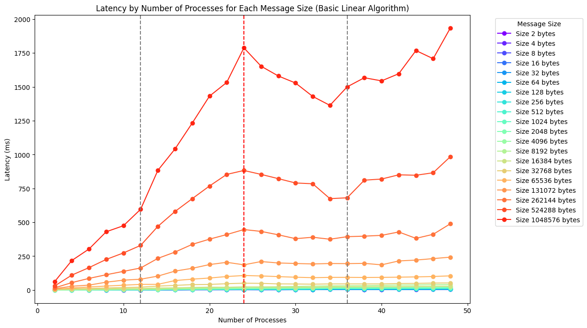
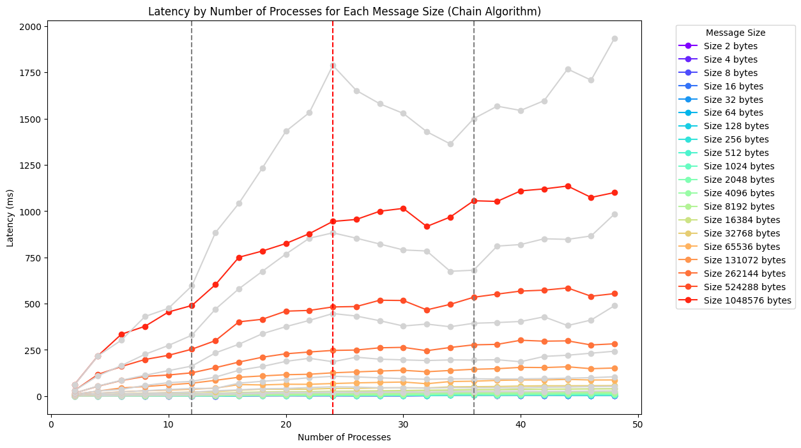
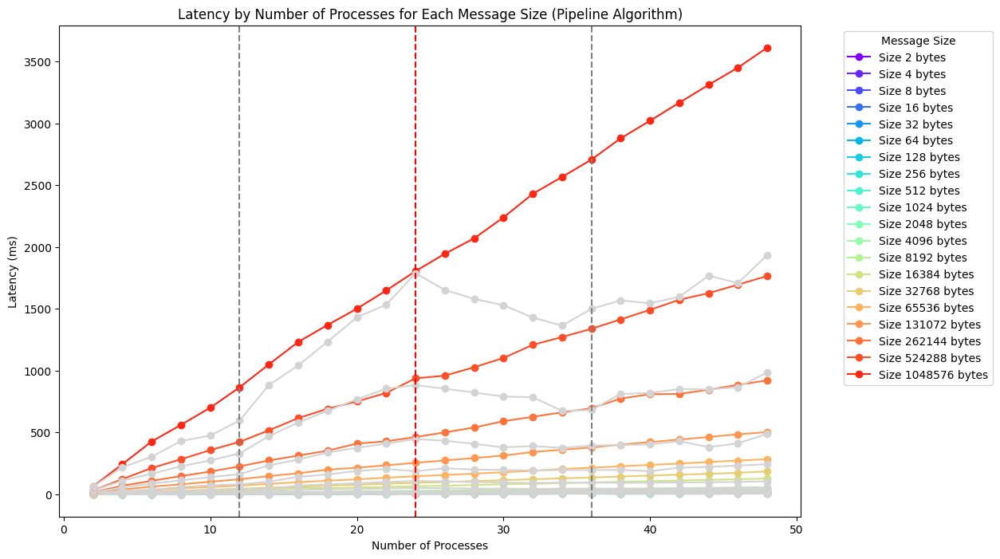
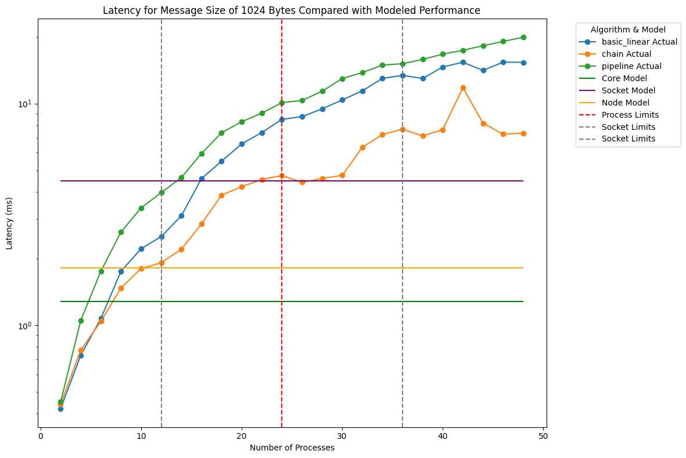
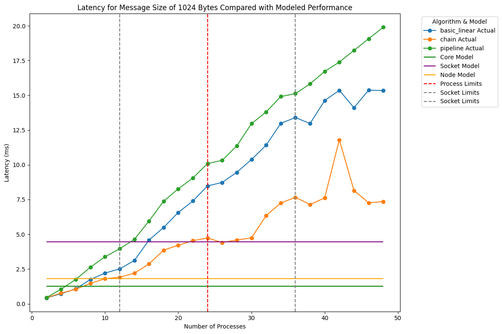
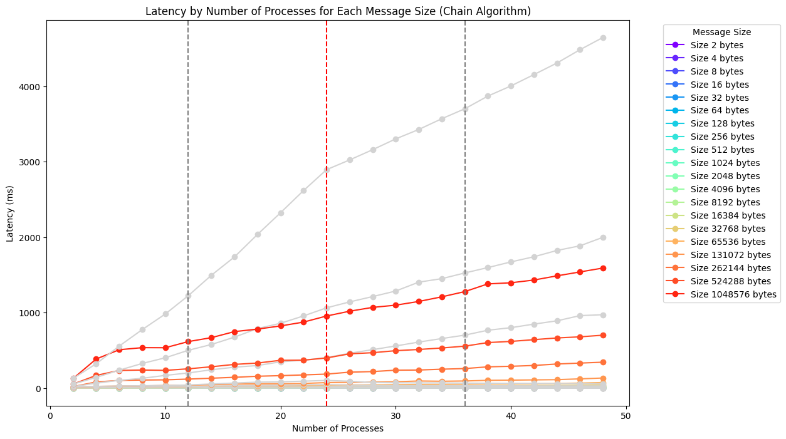

```{r setup, include=FALSE}
knitr::opts_chunk$set(echo = TRUE)

```

# Introduction

In this report, will be discussed the results of the first exercise of the High Performance Computing assignment. The objective of this project is to compare and evaluate the benchmark results of different openMPI algorithms for two different collective operations, `broadcast` and `reduce`, using the `osu-micro-benchmarks` tool, and to analyse the performance of the algorithms for different message sizes and numbers of processes on the ORFEO cluster, choosing among `EPYC`, `THIN` and `FAT` nodes.

## Starting Point

The starting point of this project is the `osu-micro-benchmarks` tool. The `osu-micro-benchmarks` tool is a set of micro-benchmarks that can be used to evaluate the performance of collective operations in MPI. The `osu-micro-benchmarks` tool provides benchmarks for a wide range of collective operations, including `broadcast`, `gather`, `scatter`, `barrier`, and `reduce`. The `osu-micro-benchmarks` tool can be used to measure the latency and bandwidth of collective operations for different message sizes and numbers of processes.

## Replication of the project

Since the ORFEO cluster is not available to everyone, this project will be represented considering a general usage for most HPCC systems with same characteristics of the ORFEO cluster.

* The O.S. of ORFEO is **Linux**, so the cluster shell is `bash` (as recommended by the ORFEO documentation, if you want a complete overview, follow the first three lectures of the "[The Missing Semester of Your CS Education](https://missing.csail.mit.edu/)", a course provided by MIT).
* **SLURM** is the workload manager used in the ORFEO cluster, an open-source job scheduler and resource management system used in high-performance computing (HPC) environments. It allows users to submit and manage jobs on a cluster of computers, allocating resources such as CPU time, memory, and GPUs.
* **LMOD** is the module system used in the ORFEO cluster and allows users to easily manage their environment by loading and unloading software packages and libraries. The module system is used to manage the software environment on the cluster, allowing users to easily switch between different versions of software packages and libraries.

## Download and Compile the OSU Benchmarks

Once accessed the server, in this case the ORFEO cluster, it is needed to download the `osu-micro-benchmarks` tool from the official website. The `osu-micro-benchmarks` tool can be downloaded from the official website using the following command via `wget` (or directly from the [official page](https://mvapich.cse.ohio-state.edu/benchmarks/)):

```bash
wget https://mvapich.cse.ohio-state.edu/download/mvapich/osu-micro-benchmarks-7.3.tar.gz
```
then, it is needed to extract the downloaded file using the following command:
```bash
tar -xzvf osu-micro-benchmarks-7.3.tar.gz
```

**Before compiling** it is needed to load any necessary modules (e.g., `openmpi`, compilers), and then following the [compilation instructions](https://mvapich.cse.ohio-state.edu/static/media/mvapich/README-OMB.txt). To see the available modules, it is possible to use the command `module avail`, which will show all the available modules. To load a module, use the command `module load <module_name>`. For example, to load the `openmpi` module, use the command `module load openmpi`.

After loading the necessary modules, it is possible to compile the `osu-micro-benchmarks` tool using the following commands:
```bash
$ ./configure CC=mpicc CXX=mpicxx  # Ensure these are the MPI compilers
$ make
```
In order to don't repeat the same commands every time, it is possible to create a script that loads the necessary modules automatically. What was done in my case was to create a script called `.bashrc`:
```bash
$ echo "module load openMPI/4.1.5/gnu/12.2.1" >> ~/.bashrc
```
in which the `openMPI` module it can be loaded with this command:
```bash
$ source ~/.bashrc
```
From here, it is possible to go on with the execution of the benchmarks.

# Execution of the Benchmarks

The `osu-micro-benchmarks` tool provides several options to control the execution of the benchmarks, including the number of processes, the size of the message, and the algorithm used for the collective operation.

The `broadcast` benchmark measures the performance of the `broadcast` operation in MPI. The `broadcast` operation is a one-to-all communication operation that sends a message from the root process to all other processes in the communicator. 
The `broadcast` benchmark can be executed using the following command as example:

```bash
$ mpirun -np <num_processes> osu_bcast
```

The `reduce` benchmark measures the performance of the `reduce` operation in MPI. The `reduce` operation is a many-to-one communication operation that combines data from all processes in the communicator into a single value. The `reduce` benchmark measures the latency and bandwidth of the `reduce` operation for different message sizes and numbers of processes.

The `reduce` benchmark can be executed using the following command as example:

```bash
$ mpirun -np <num_processes> osu_reduce
```

For both choosen benchmark, were tested the latency and bandwidth of the default openMPI implementation, varying the number of processes and the size of the messages exchanged. Then, it will be compared with the values obtained using different algorithms, basic_linear (1), chain (2) and pipeline (3) algorithm.

# Execution of the Benchmarks in a HPC Cluster

For the execution of the benchmarks, it is needed to use the `mpirun` command, which is used to launch MPI applications. The `mpirun` command takes several arguments, including the number of processes, the name of the executable, and any additional arguments that needs to be passed to the executable.

The parameters for this project are the following:

* Number of processes: from 1 to 48 (by 2)
* Message size: 2, 4, 8, 16, 32, 64, 128, 256, 512, 1024, 2048, 4096, 8192, 16384, 32768, 65536, 131072, 262144, 524288, 1048576.

Number of processes will be tested from 1 to 48 (by 2), while the message size will be tested from 2 bytes to 1 MB ($2^{20}$). The benchmarks will be executed using the default openMPI implementation and the `basic_linear`, `chain`, and `pipeline` algorithms for the `broadcast` and `reduce` operations.

The execution of the benchmarks can be done using, for example, the following commands:

```bash
$ mpirun -np <num_processes> osu_bcast -m <message_size> -a 1
# ... or
$ mpirun -np <num_processes> osu_reduce -m <message_size> -a 1
```

# Execution of the Benchmarks in the ORFEO Cluster

In every cluster, it is important to check and verify every parameters in order to **not waste resources** and doing the job in the right way. The ORFEO cluster is a shared resource, and it is important to be considerate of other users. 

This first check can be done using the command `sinfo` that shows the status of the partitions and nodes in the cluster, including the number of nodes available, the number of nodes in use, and the number of nodes down. Or, can be easily used `scom` that is a light TUI that helps to manage the jobs in the cluster, gather info about them and keep track of the work. 

During the project, the only available partition was `THIN`, which have the following general characteristics:

|Computing Nodes | Nodes | CPUs| CPU Cores | Memory | Network |  
|- | - | - | - | - | - |
| THIN |10 nodes | 2 x Intel Xeon Gold 6126| 24 (2x12) | 768 GB of RAM  | 1 x 100 Gb/s | 

For other aspects of the computational resources, check the [ORFEO Cluster](https://orfeo-doc.areasciencepark.it/HPC/computational-resources/) documentation.

## Writing the SLURM Script

The SLURM script is a shell script that contains the commands to run the benchmarks on the cluster. The SLURM script specifies the parameters for the job, including the name of the job, the output and error files, the partition, the number of nodes, the number of tasks per node, the time limit, and the exclusive flag. The SLURM script also contains the commands to load the necessary modules and to run the benchmarks.

The SLURM script can be written using a text editor, such as `vim` or `nano`. So, the SLURM script should contain the following commands:

```bash
#!/bin/bash
#SBATCH --job-name=bcast-benchmark
#SBATCH --output=bcast_output_%j.txt
#SBATCH --error=bcast_error_%j.txt
#SBATCH --partition=THIN
#SBATCH --nodes=2
#SBATCH --ntasks-per-node=24
#SBATCH --time=<estimated-time-for-job>
#SBATCH --exclusive
```
The using of SBATCH commands is important in order to specify the parameters for the job:

* The `--job-name` parameter specifies the name of the job, which will be used to identify the job in the queue.
* The `--output` parameter specifies the name of the output file, which will contain the output of the job. 
* The `--error` parameter specifies the name of the error file, which will contain any error messages generated by the job. 
* The `--partition` parameter specifies the partition on which the job should run. 
* The `--nodes` parameter specifies the number of nodes on which the job should run.
* The `--ntasks-per-node` parameter specifies the number of tasks per node. 
* The `--time` parameter specifies the time limit for the job. 
* The `--exclusive` parameter specifies that the job should have exclusive access to the nodes.

Obviously, can be more specific and add more parameters to the script, for example the `--constraint` parameter that specifies the constraint for the job, or the `--mem` parameter that specifies the amount of memory required for the job, etc. Also, the script should contain the necessary commands to load the modules and run the benchmarks.

For this project, as said before, it was tested the `broadcast` and `reduce` operations using the default openMPI implementation and the `basic_linear`, `chain`, and `pipeline` algorithms. The benchmarks was executed using 2 `THIN` partition nodes, using all the available cores on a single node. The output of the benchmarks were saved in separate files for each algorithm and operation, and the results were analysed to compare the performance of the different algorithms.

# Analysis of the Results

For the analysis of the results, it was used Python for simplicity and to have a better visualization of the data. The final analysis are inside jupyter notebooks that are available in the `bcast.ipynb` and `reduce.ipynb` files.

## Choosing a Fixed Message Size

When selecting a fixed message size for this comparison analysis, can be beneficial to choose a value that is representative of typical communication patterns in the application or system being studied. This will help ensure that the results are relevant and applicable to real-world scenarios:

1. Common Size in Practice: Sizes like 256 bytes, 1024 bytes (1KB), or 65536 (64KB) bytes are often used in benchmarks as they represent typical message sizes in many applications.
2. Coverage in Data: In order to be replicated, it is important to ensure that the chosen size is well-represented across all the datasets, meaning it should have sufficient data points in both segmented performance models and the MPI broadcast benchmarks.
3. Statistical Significance: Larger message sizes can highlight differences between algorithms more distinctly, as the impact of latency becomes more pronounced.

Given these considerations, a size like **1024 bytes** might be a balanced choice, offering a good mix of practical relevance and statistical robustness, and will be used for this analysis.

## Performance Model 

During the analysis, will be used a basic performance models. For theoretical performance modelling, it is possible to estimate the latency of point-to-point communication routines, since collective are built on top of them. Inside the OSU benchmark, there is a osu latency test that can be used to measure the latency of point-to-point communication routines. The latency is measured also in microseconds and is the time taken to send a message from one process to another. The latency is influenced by the network latency, the time taken to send a message from one process to another, and the system overhead, the time taken by the system to handle the message. 

Considering the structure of the ORFEO cluster, it was done performance benchmark mapping by core, by socket and by nodes. Then, the data obtained, were used also for a comparison with Broadcast and Reduce operations.

# Broadcast Operation

The `broadcast` operation is a one-to-all communication operation that sends a message from the root process to all other processes in the communicator. The `broadcast` operation is a common operation in parallel programming, and it is used to distribute data from one process to all other processes in the communicator. The performance of the `broadcast` operation can be affected by factors such as the size of the message, the number of processes, the network topology, and the communication pattern.

From the results of the benchmarks, that were saved in a csv file, it is possible to analyse the performance of the `broadcast` operation using the different algorithms. 


## Basic Linear Algorithm

The `basic_linear` algorithm is a simple algorithm where, for N processes, the root sends the message to ne N-1 other processes. This type of algorithm is used as a baseline to compare with the other two algorithms.

\begin{wrapfigure}{r}{0.5\textwidth}
\includegraphics[width=1\linewidth]{figures/figure_1.png}
\caption{Latency vs Processes for Basic Linear Algorithm}
\label{fig:figure_3}
\end{wrapfigure}

<!-- | Pros | Cons | -->
<!-- |------|------| -->
<!-- | Simple and straightforward | Inefficient for large data sizes and large numbers of processes | -->
<!-- | Effective for small numbers of processes and small data sizes | High latency as each send operation has to complete before the next begins | -->

Pros: Simple and straightforward, Effective for small numbers of processes and small data sizes.

Cons: Inefficient for large data sizes and large numbers of processes, High latency as each send operation has to complete before the next begins.

<!-- {width=60% height=60%} -->

From the broadcast benchmarks csv file, it is possible to analyse the latency for processes (cores) and for different message sizes. As a first look, it is possible to see that the latency increases with the number of processes and the message size, as expected. From figure 1, it is possible to see that, for a message size of 2 bytes, the latency is lower than for a message size of 1 MB. This is because the message size affects the time it takes to send the message over the network. The latency increases with the message size because it takes longer to send a larger message over the network. 

## Chain Algorithm

\begin{wrapfigure}{r}{0.5\textwidth}
\includegraphics[width=1\linewidth]{figures/figure_2.png}
\caption{Latency vs Processes for Chain Algorithm}
\label{fig:figure_3}
\end{wrapfigure}

The `chain` algorithm uses a tree structure but it forms a chain-like structure. The root sends the data to one process, which then forwards it to another, and this continues until all have received the data.

Pros: More scalable than the Basic Linear.

Cons: Still not fully optimal for very large numbers of processes.


<!-- | Pros | Cons | -->
<!-- |------|------| -->
<!-- | More scalable than the Basic Linear | Still not fully optimal for very large numbers of processes | -->

<!-- {width=60% height=60%} -->

From figure 2, it is plotted the latency for the `chain` algorithm, for different message sizes as before, and in grey, the latency for the `basic_linear` algorithm to compare. It is possible to see that the latency for the `chain` algorithm is lower than for the `basic_linear` algorithm, especially for larger numbers of processes and larger message sizes. This is because the `chain` algorithm is more efficient than the `basic_linear` algorithm. 

## Pipeline Algorithm

The `pipeline` algorithm is a more complex algorithm that divides the message into smaller blocks and pipelines them across the processes. This allows multiple parts of the message to be in transit simultaneously, exploiting higher bandwidth. 

<!-- |Pros | Cons | -->
<!-- |------|------| -->
<!-- | Highly efficient for lare messages | Complexity in implementation increases | -->
<!-- | Reduces the impact of latency | May be overkill for very small data sizes or when bandwidth is not a limiting factor | -->

<!-- {width=60% height=60%} -->

\begin{wrapfigure}{r}{0.5\textwidth}
\includegraphics[width=1\linewidth]{figures/figure_3.png}
\caption{Latency vs Processes for Pipeline Algorithm}
\label{fig:figure_3}
\end{wrapfigure}

Pros: Highly efficient for large messages, Reduces the impact of latency.

Cons: Complexity in implementation increases, May be overkill for very small data sizes or when bandwidth is not a limiting factor.

From figure 3, it is plotted the latency for the `pipeline` algorithm, for different message sizes as before, and in grey, the latency for the `basic_linear` algorithm to compare. It is possible to see that the latency for the `pipeline` algorithm is higher than for the `basic_linear` algorithm for higher numbers of processes and larger message sizes. This is because the `pipeline` algorithm is more complex than the `basic_linear` algorithm, and could it may introduce additional overhead that can increase the latency.

Theoretically, the `pipeline` algorithm tends to be the most efficient for large-scale systems and large data due to its ability to overlap communications and make better use of available bandwidth. However, the best choice of algorithm can depend on specific system characteristics, such as the network topology, the number of processes, and the message size. In this case, the `chain` algorithm seems to be the most efficient for the `broadcast` operation, as it provides a good balance between performance and complexity.

## Segmented Linear Model Parameters for Broadcast Operation

From the results of the benchmarks, it was used a segmented linear model to estimate the models parameters for the `broadcast` operation. The choice of the segmented linear model was made based on the analysis of the data, which shows distinct differences between the socket, core, and node mappings.

\noindent
\begin{minipage}{0.4\textwidth}
\scriptsize
\begin{tabular}{|l|r|r|l|}
\hline
\textbf{Algorithm} & \textbf{Intercept} & \textbf{Slope} & \textbf{Processes} \\
\hline
Basic Linear & -4.9230 & 6.2399 & $\leq 12$ \\
Basic Linear & -38.9755 & 9.0776 & $\leq 24$ \\
Basic Linear & 242.8622 & -2.6656 & $\leq 36$ \\
Basic Linear & 5.2882 & 3.9336 & $\leq 48$ \\
Chain & 1.6616 & 4.7161 & $\leq 12$ \\
Chain & 15.3920 & 3.5719 & $\leq 24$ \\
Chain & 79.4132 & 0.9043 & $\leq 36$ \\
Chain & 82.1021 & 0.8297 & $\leq 48$ \\
Pipeline & -8.7844 & 8.6303 & $\leq 12$ \\
Pipeline & -3.2284 & 8.1672 & $\leq 24$ \\
Pipeline & -1.0667 & 8.0772 & $\leq 36$ \\
Pipeline & 10.1810 & 7.7647 & $\leq 48$ \\
\hline
\end{tabular}
\end{minipage}
\hfill
\begin{minipage}{0.5\textwidth}
\centering
\includegraphics[width=\textwidth]{figures/figure_4.png}
\captionof{figure}{Latency vs Processes for Broadcast Operation}
\end{minipage}

From figure 4, it is possible to see the comparison between the algorithms for the fixed message size of 1024 bytes. The `chain` algorithm has the lowest latency for all numbers of processes, followed by the `basic_linear` algorithm and the `pipeline` algorithm.


## Segmented Linear Model Parameters for Performance Model for Core, Socket, Node mapping

As mentioned, the performance model here is theoretical and is used to estimate the latency of point-to-point communication routines, since collectives are built on top of them. The same applies to the broadcast operation and the subsequent analysis with the reduce operation. A segmented linear model was used to estimate the model's parameters. The difference between the broadcast (and reduce) models is justified by the difference in the transmission of data by core, socket, and nodes.

\noindent
\begin{minipage}{0.4\textwidth}
\scriptsize
\begin{tabular}{|l|r|r|l|}
\hline
\textbf{Mapping} & \textbf{Intercept} & \textbf{Slope} & \textbf{Size} \\
\hline
Core & 1.1736 & 0.0001 & $\leq 1043980$ \\
Core  & -29.4428 & 0.0001 & $\leq 4194304$ \\
Socket & 4.3637 & 0.0001 & $\leq 1048567$ \\
Socket & -24.7014 & 0.0001 & $\leq 4194304$ \\
Node & 1.6064 & 0.0002 & $\leq 83862$ \\
Node & 10.2541 & 0.0001 & $\leq 4194304$ \\
\hline
\end{tabular}
\end{minipage}

$$\text{Latency} = \text{Intercept} + \text{Slope} \times \text{Size}$$

## Compare Benchmark Results with Performance Model

```{r echo=FALSE, out.width='49%', fig.show='hold'}


```

From the left plot, it is possible to see the comparison of the benchmark results with the theoretical performance model for the `broadcast` operation. The benchmark results are shown as dots, and the performance model is shown as a line. For a better visualization, the results are shown for a fixed message size of 1024 bytes and in a log scale for the latency (y-axis).

From right plot, the basic linear (blue line) shows a steady increase in latency as the number of processes increases. The increase appears roughly linear, especially after the 24-process mark. This reflects the inherent inefficiency of the algorithm as it sequentially communicates with each process. 

The Chain algorithm (orange line) experiences a significant spike at around 44 processes, followed by a sharp decline. This spike may indicate some form of congestion or bottleneck specific to this setup at higher process counts. 

The pipeline algorithm (green line) displays the most consistent and gradual increase in latency among the three algorithms. It remains the most stable and efficient, particularly at higher process counts, likely due to its ability to overlap communication effectively.

# Reduce Operation

The MPI Reduce operation is a fundamental collective communication function used in parallel computing environments. It combines data from all processes in a communicator using a specified operation and return the result to a designated root process. Common uses of MPI Reduce include summing values from multiple processes, finding global minimums or maximums, or performing other reduction operations such as logical and/or across distributed data. So, Reduce operation is a many-to-one communication pattern in MPI. 

The distinction between the Reduce and Broadcast operation is mainly about the flow of data and the intention behind the operation:

* **Many-to-one(`MPI_Reduce`)**: Aggregate data from many sources to one destination, combining them into a single result.
* **One-to-many(`MPI_Broadcast`)**: Distribute data from one source to many destinations, replicating the data.

To replicate the same analysis of the Broadcast operations for the Reduce operations, it was used the same algorithms.

## Basic Linear Algorithm

\begin{wrapfigure}{r}{0.5\textwidth}
\includegraphics[width=1\linewidth]{figures/figure_7.png}
\caption{Latency vs Processes for Basic Linear Algorithm}
\label{fig:figure_7}
\end{wrapfigure}

From the figure 5, it is possible to see the latency for the `basic_linear` algorithm, for different message sizes as before. For smaller message sizes (up to about 32KB), the increase in latency as the number of processes grows is relatively moderate. For larger message sizes, from 32KB and beyond, the latency increases significantly with the number of processes. The impact of increasing message size on latency is more pronounced at higher process counts. This suggests that network congestion or bandwidth limitations become significant factors when larger amounts of data are being transmitted across many processes. However, the latency remains relatively stable for message sizes up to 256 bytes, regardless of the number of processes (visible from the data).

## Chain Algorithm

\begin{wrapfigure}{r}{0.5\textwidth}
\includegraphics[width=1\linewidth]{figures/figure_8.png}
\caption{Latency vs Processes for Chain Algorithm}
\label{fig:figure_8}
\end{wrapfigure}

From the figure 6, it is possible to analyse the latency for the `chain` algorithm with the same message sizes as before and in grey the latency for the `basic_linear` algorithm used as a baseline to compare. The `chain` algorithm benchmark's latency shows significantly lower latencies compared to the `basic_linear` algorithm across most message sizes, particularly evident as the message size increases. For smaller message size, the latency are very close to those of the `basic_linear` algorithm but begin to show substantial improvement as the message size increases. The latency tends to increase with the number of processes, bu the rate of increase is much slower compared to the `basic_linear` algorithm, suggesting better scalability. So, Both algorithms show increased latency with larger message sizes, but the increase is much steeper for the Basic Linear algorithm. This suggests that the Chain algorithm manages larger messages more efficiently, likely due to better use of network resources and reduced contention at the root.

<!-- {width=60% height=60%} -->

<!-- {width=60% height=60%} -->

## Pipeline Algorithm

\begin{wrapfigure}{r}{0.5\textwidth}
\includegraphics[width=1\linewidth]{figures/figure_9.png}
\caption{Latency vs Processes for Pipeline Algorithm}
\label{fig:figure_9}
\end{wrapfigure}

From Figure 7, it is possible to analyze the latency for the pipeline algorithm with the same message sizes as before, and in grey, the latency for the basic_linear algorithm used as a baseline for comparison. As observed previously with the broadcast operation, the pipeline algorithm shows the highest latency among the three algorithms for most message sizes and process counts. This increase in latency suggests that there may be inefficiencies or overheads associated with the pipelining process as implemented or under the specific testing conditions. This could indicate potential scalability issues or inefficiencies in the algorithm's ability to manage parallel data transfer effectively under this benchmark.


## Segmented Linear Model Parameters for Reduce Operation

From the results of the benchmarks, it was again used a segmented linear model to estimate the models parameters for the `reduce` operation. 

\noindent
\begin{minipage}{0.4\textwidth}
\scriptsize
\begin{tabular}{|l|r|r|l|}
\hline
\textbf{Algorithm} & \textbf{Intercept} & \textbf{Slope} & \textbf{Processes} \\
\hline
Basic Linear & -5.5752 & 8.8071 & $\leq 12$ \\
Basic Linear & -27.7313 & 10.6242 & $\leq 24$ \\
Basic Linear & 75.7373 & 6.3276 & $\leq 36$ \\
Basic Linear & 56.5351 & 6.8610 & $\leq 48$ \\
Chain & 15.7189 & 3.4360 & $\leq 12$ \\
Chain & 27.1313 & 2.4350 & $\leq 24$ \\
Chain & 21.5941 & 2.6907 & $\leq 36$ \\
Chain & 27.4018 & 2.5294 & $\leq 48$ \\
Pipeline & -19.0308 & 13.6258 & $\leq 12$ \\
Pipeline & 5.9460 & 11.5444 & $\leq 24$ \\
Pipeline & -12.1973 & 12.3004 & $\leq 36$ \\
Pipeline & -23.1359 & 12.6042 & $\leq 48$ \\
\hline
\end{tabular}
\end{minipage}
\hfill
\begin{minipage}{0.5\textwidth}
\centering
\includegraphics[width=\textwidth]{figures/figure_10.png}
\captionof{figure}{Latency vs Processes for Reduce Operation}
\end{minipage}

<!-- |Algorithm| Intercept | Slope | Processes | -->
<!-- |-|-------|-----------|-----------| -->
<!-- |Basic Linear| -5.5752 | 8.8071 | $\leq 12$ | -->
<!-- |Basic Linear| -27.7313 | 10.6242 | $\leq 24$ | -->
<!-- |Basic Linear| 75.7373 | 6.3276 | $\leq 36$ | -->
<!-- |Basic Linear| 56.5351 | 6.8610 | $\leq 48$ | -->
<!-- |Chain | 15.7189 | 3.4360 | $\leq 12$ | -->
<!-- | Chain | 27.1313 | 2.4350 | $\leq 24$ | -->
<!-- | Chain | 21.5941 | 2.6907 | $\leq 36$ | -->
<!-- | Chain | 27.4018 | 2.5294 | $\leq 48$ | -->
<!-- | Pipeline | -19.0308 | 13.6258 | $\leq 12$ | -->
<!-- | Pipeline | 5.9460 | 11.5444 | $\leq 24$ | -->
<!-- | Pipeline | -12.1973 | 12.3004 | $\leq 36$ | -->
<!-- | Pipeline | -23.1359 | 12.6042 | $\leq 48$ | -->

$$\text{Latency} = Intercept + Slope \times Processes$$

Under this consideration, again the `chain` algorithm seems to be the most efficient for the `broadcast` operation, as it provides a good balance between performance and complexity. From the figure 8 it is possible to see the comparison between the algorithms for the fixed message size of 1024 bytes. The `chain` algorithm has the lowest latency for all numbers of processes, followed by the `basic_linear` algorithm and the `pipeline` algorithm. The `basic_linear` algorithm performance is surprisingly efficient compared to the other two, which might be due to the simplicity of the algorithm that aligns well with the hardware and MPI configuration used. The `chain` algorithm, expected to perform better than the `basic_linear` algorithm, shows a slight higher latency, with an spike at higher process counts that could be influenced by the way data is transmitted in a chain sequence, potentially leading to increased delays as more processes are involved. The `pipeline` algorithm, that as said before is typically designed to excel in environments where large data sets are broken down and processed in segments to utilize network bandwidth more effectively, shows the highest latencies across all process counts, suggesting overheads in setting up and managing the pipeline, or possibly contention when multiple data segments are in transit.

## Compare Reduce Benchmark Results with Performance Model

\begin{wrapfigure}{r}{0.5\textwidth}
\includegraphics[width=1\linewidth]{figures/figure_11.png}
\caption{Reduce Benchmark Results with Performance Model}
\label{fig:figure_11}
\end{wrapfigure}

Using the same performance model as before, it is possible to compare for the same fixed message size of 1024 bytes the benchmark results with the theoretical performance model. From the plot, as analysed, it is possible to confirm the efficiency of the `basic\_linear` algorithm for this fixed message size taken for analysis, slightly outperforming the `chain` algorithm in terms of maintaining lower latency across all process counts considering both the performance model of the latency between the core, socket, and node mapping. The `pipeline` algorithm, on the other hand, shows the highest latency across all process counts.


\newpage

## References

1. [Orfeo Cluster Documentation](https://orfeo-doc.areasciencepark.it/HPC/computational-resources/)

2. [OSU Micro-Benchmarks](https://mvapich.cse.ohio-state.edu/benchmarks/)

3. [The Missing Semester of Your CS Education](https://missing.csail.mit.edu/)

4. [SLURM Workload Manager](https://slurm.schedmd.com/)

5. [LMOD Module System](https://lmod.readthedocs.io/en/latest/)

6. [MPI Collective Operations](https://www.mpi-forum.org/docs/mpi-3.1/mpi31-report/node109.htm)

7. [Model-based selection of optimal MPI broadcast algorithms for multi-core clusters](https://www.sciencedirect.com/science/article/pii/S0743731522000697?via%3Dihub)


