# High Performance Computing - Exercise 2 (2C) 

# Mandelbot Set using MPI + OpenMP

## Introduction

In this report, will be discussed the results of the second exercise of the High Performance Computing assignment. The objective of this exercise is to implement the Mandelbrot Set using MPI and OpenMP, obtaining a single pgm image as output, and analysing the scalability of the implementation:

- OMP scaling: run with a single MPI task and increase the number of OMP threads;
- MPI scaling: run with a single OMP thread per MPI task and increase the number of MPI tasks;
- Hybrid scaling (such an extra analysis - not required for the assignment): run for different combinations of MPI and OMP threads.

As for the first exercise/assignment, the project was implemented to be used in the ORFEO HPC Cluster, using THIN nodes. The project was implemented in C language, using the MPI and OpenMP libraries, SLURM for job submission (file .sbatch), and Python for data analysis and plotting. 

### Replication of the project

Since the ORFEO Cluster is not available for external users, the project can be replicated in a local machine or in another cluster and be represented considering a general usage for most of the HPC systems with same characteristics of the ORFEO Cluster. For extra information about the ORFEO Cluster, please refer to the [ORFEO Documentation](https://orfeo-doc.areasciencepark.it/HPC/).

## Description of the project

The Mandelbrot set is a fascinating and well-known construct in complex dynamics, generated by iterating a simple complex function on the complex plane $\mathbb{C}$. Specifically, this set is defined using the function $f_c(z)$ given by:

$$f_c(z) = z^2 + c$$

Here, _c_ is a complex number $c = x + iy$, and the iteration starts with $z = 0$, producing a series of complex numbers $z_0, z_1, z_2, ...$ defined by:

$$z_0 = 0, z_1 = f_c(0), z_2 = f_c(z_1), \space \dots \space , z_n = f_c^n(z_{n-1})$$

The Mandelbrot set $\mathcal{M}$ consists of all complex points _c_ for which this series remains bounded. A key characteristic of the Mandelbrot set is that if any element $z_i$ in the series has a magnitude greater that 2, the series will eventually become unbounded. Therefore, a point _c_ is considered to be in the Mandelbrot set $\mathcal{M}$ if :

$$|z_n| < 2 \space \text{for all} \space n \leq I_{max}$$

where $I_{max}$ is a parameter that sets the maximum number of iterations, balancing the accuracy of the calculation with computational cost.

To visualise the Mandelbrot set, we can generate an image representing a portion of the complex plane. This portion is bounded by two corners: the bottom-left corner $c_L = x_L + iy_L$, and the top right corner $c_R = x_R + iy_R$. the image is composed on $n_x \times n_y$ pixels, each corresponding to a point $c_i$ in the complex plane:

$$c_i = (x_L + \Delta x) + i(y_L + \Delta y)$$

where:

$$\Delta x = \frac{x_R - x_L}{n_x}$$

and 

$$\Delta y = \frac{y_R - y_L}{n_y}$$

We define a 2D matrix $M$ of integers where each entry $[j][i]$ corresponds to a pixel in the image. The value of each pixel is determined by whether the corresponding point _c_ belongs to the Mandelbrot set $\mathcal{M}$. If _c_ belongs to $\mathcal{M}$, the pixel value is 0. Otherwise, the pixel value is the iteration count $n$ at which the magnitude of $z_n(c)$ exceeds 2, up to a maximum value of $I_{max}$.

This problem is inherently parallelisable since each point $c_i$ can be computed independently. However, distributing the computational load evenly among concurrent processes or threads can be challenging due to the varying complexity of different regions of the Mandelbrot set. Inner points of $\mathcal{M}$ require more iterations to determine their membership, whereas outer points are computationally simpler. The bundary between these regions, the "frontier", is particularly complex and requires careful consideration to avoid load imbalance in parallel implementations.

> **Note 1**: Mandelbrot set lives roughly in the circular region centered on $(-0.75, 0)$ with a radius of $\sim 2$.

> **Note 2:** the multiplication of 2 complex numbers is defined as $(x_1 + iy_1)\,\times\,(x_2+iy_2) = (x_1x_2 - y_1y_2) + i(x_1y_2+x_2y_1)$

With those notes in mind, we can expand basic Mandelbrot set computation to more accurately explore regions within the Mandelbrot set and potentially implement functionality that considers complex number multiplication.

## Reason behind the choice of this project

Implementing the Mandelbrot set calculation project is intriguing for several reasons. Firstly, it allows for the visualization of complex dynamics, providing a fascinating insight into fractal geometry and iterative processes involving complex numbers. The computational challenge of generating high-resolution images of the Mandelbrot set requires significant computational power, making it an excellent problem for exploring computational methods and performance optimization. 

The Mandelbrot set problem is inherently parallelisable since the calculation for each point in the complex plane is independent of others. This characteristic makes it ideal for testing parallel computing techniques. By utilizing a hybrid approach combining MPI (Message Passing Interface) and OpenMP (Open Multi-Processing), we can leverage the strengths of both distributed and shared memory architectures. MPI is used to handle communication between nodes in a cluster, while OpenMP manages parallelism within each node. This hybrid parallelism approach is well-suited for high-performance computing (HPC) clusters.

Moreover, by implementing and testing the Mandelbrot set computation on an HPC cluster, we can gather valuable performance metrics such as speedup, efficiency, and scalability. These metrics provide insights into how well the hybrid MPI-OpenMP approach performs under different configurations and workloads. Scalability testing can be extensively performed by varying the number of nodes (using MPI) and the number of threads per node (using OpenMP). This analysis helps identify bottlenecks and optimize performance for large-scale computations.

The techniques and insights gained from this project have broader applications beyond fractal geometry. They are relevant to other scientific and engineering problems that require high-performance computing, such as climate modeling, molecular dynamics, and large-scale data analysis. Understanding how to efficiently utilize HPC resources is crucial for advancing computational capabilities in these fields. It is a practical and visually engaging way to test and improve computational techniques in a high-performance environment, with implications for a wide range of real-world applications.

## Starting point

Since the Mandelbrot set resides within a circle centered around $(-0.75, 0)$ with a radius of $\sim 2$, we can set our program to generate a grid of points around this region to visualize the set. To do this efficiently and effectively, it is possible to start by computing a range of points that covers this area.

**Implementation steps**:
1. Setup a grid: Defining a grid of complex nubers centered around $(-0.75, 0)$ with a radius of $\sim 2$.
2. Iterating over each point: For each point on this grid, it is possible to determine whether it belongs to the Mandelbrot set using the iterative method.

For the first test, it was implemented a simple script where the program writes the output to a file in txt format, in ASCII mode. 

Inside `local_test` folder, it was created a simple script to generate the Mandelbrot set in a txt file, then implemented to create a pgm image with different sizes and resolutions. This was done to test initial implementations and to understand the structure of the Mandelbrot set.


## Parallelisation 

The next step was to parallelise the Mandelbrot set computation using MPI and OpenMP, aiming for an hybrid approach to efficiently leverage multiple processors and cores.

To use MPI (Message Passing Interface), we need to include MPI functions in the script and initialise MPI in the program. This allows to run across multiple processes, which may be distributed across different nodes in a cluster.

OpenMP was used for shared-memory parallelism with each MPI process. This allows each process to further split its workload among multiple threads, making effective use of multi-core architectures.

The parallelisation strategy involved dividing the grid of points among MPI processes, so that each MPI process is responsible for a specific part of the image. This involves splitting the image grid into segments (typically horizontal stripes) that each process will compute. 

Then, once all processes have completed their computations, the results need to be gathered and assembled into the final PGM image. Thic can be handled in various ways, including using MPI I/O to write directly to the file in parallel or collecting the results in the root process and writing the final image from there.

Since the project requires the creation of an hybrid script, it was firstly integrated MPI to handle calculation on multiple nodes. After that, OpenMP was integrated to handle calculation on multiple threads within each node.

For each test conducted in the project, there were created specific folders to store the results and the scripts used to run and obtain the results. So, firstly it was created the MPI integration (`mpi`), then the hybrid with OpenMP integration (`mpi_omp2`), and finally, with the hybrid implementation, it was conducted the tests and analysis described in the introduction of this report.

## Strategies for the analysis

To make the analysis of the results, it was used the `time` (`/usr/bin/time -v`) command, which is used to measure the execution time of a command and report various resource usage statistics. The `-v` flag stands for  "verbose" mode. I tells `time` command to provide detailed information about the program's execution, including:

- User CPU time (seconds): The total time spent in user mode during process execution. Includes time spent executing user-level code, excluding the operating system kernel.

- System time (seconds): The total time spent in system mode. This time includes work done by the kernel on behalf of the process, such as I/O operations.

- Percent of CPU this job got: Percentage of the CPU allocated to this process. A value above 100% indicates that the process has used moe than one CPU core.

- Elapsed (wall clock) time (seconds): Time elapsed from start to finish of command execution as if measured by a stopwatch. This is the total execution time of the programme.

- Maximum resident set size (kbytes): The maximum amount of physical memory used by the process during execution.

- Major (requiring I/O) page faults: The number of page faults that required I/O operations. These are generally time-consuming as they involve loading data from disk.

- Minor (reclaiming a frame) page faults: The number of page faults that did not require I/O operations, indicating that the data was already available elsewhere in memory.

- Voluntary context switches: The number of times the process voluntarily gave up the CPU, typically to wait for a resource to become available. 

- Involuntary context switches: The number of times the operating system has forced the process to hand over the CPU to another process.

With these data, it is possible to analyse the scalability of the implementation, analyse the performance, identify bottlenecks, and measuring the impact of the parallelisation. Choosing the metrics, they can be used to analyse:

- Efficiency: Comparing user time, system time, and total execution time for different numbers of MPI processes and OpenMP threads will help to understand how efficiently the programme is utilising system resources.

- Bottlenecks: A high number of major page faults may indicate bottlenecks related to I/O operations, while an high number of unintentional context switches may indicates excessive competition for processor resource.

- Parallelisation Impact: Increasing the CPU percentage and comparing it with execution times for different configurations of MPI and OpenMP can show the effectiveness of parallelisation.

## OpenMP Analysis

The script was run with a single MPI task and increasing the number of OpenMP threads. Using the same script, it was implemented a specific file sbatch to run the script with different number of threads while collecting detailed timing and resource usage information. For this test was requested 1 node, allocating 24 CPUs for the task (all cores on the THIN node). 

```{bash}
## Load the required modules
module load openMPI/4.1.5/gnu/12.2.1

## Compile the program
mpicc -o mandelbrot_scal_omp -fopenmp mandelbrot_mpi_omp.c

## Test for different number of OpenMP threads

for threads in 1 2 4 8 12 16 20 24
do
   export OMP_NUM_THREADS=$threads
   echo "Running with $threads OpenMP threads:"
   /usr/bin/time -v ./mandelbrot_scal_omp
done
```


### Efficiency

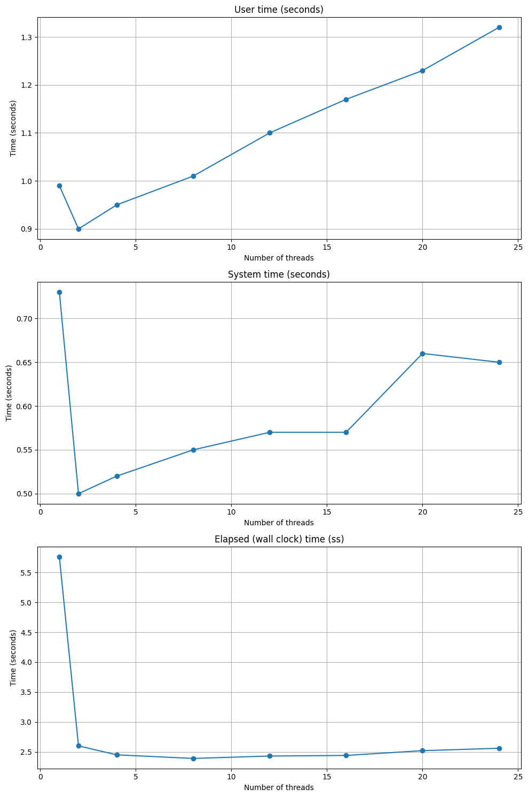

- **User time**: The graph of user time shows an almost linear increase as the number of thread increases. This indicates that the program is performing more overall work with the addition of threads, which is to be expected if each thread performs a significant portion of the total work. However, a linear increase in user time with more threads could also suggest that there are portions of code that do not benefit from parallelism or that there are synchronisations or communication latencies that limit the effectiveness of parallelisation. Ideally, we would like to see a plateau or even a decrease in user time per thread as the number of threads increases, indicating an effective use of parallelism to reduce the load on each core.

- **System time**: The system tume initially shows a dramatic decrease, stabilising later and increasing slightly as more threads are added. The initial decrease is positive, indicating that the system overhead per thread decreases when there are few threads. The later increase may reflect the increasing overhead associated with handling more threads. An increase in system time with many threads may indicate that the management of the threads themselves, including synchronisation between them, is consuming system resources. It could be useful to explore methods of reducing this overhead, such as optimising critical sections of code or using a different parallelism model.

- **Elapsed (wall clock) time**: This graph shows a significant improvement in total execution time as the number of threads increases from 1 to 12, after which the benefits stabilise. This is a clear indicator that the application benefits from parallelism up to a certain point, beyond which thread management overheads and resource saturation probably limit further improvements. The plateau in execution time suggests that there are physical limits or limitations in the code that prevent further improvements. Further optimisation of the code or an exploration of hardware limitations, such as memory bandwidth or cache conflicts, which may affect scalability, may be necessary.

In summary, the results show that the programme benefits from the addition of threads up to a certain number, after which the gains in execution time are reduced. This is typical of programmes performing heavy calculations that can be effectively parallelised, but only as long as no resource bottlenecks or architecture limitations are encountered.

### Bottlenecks

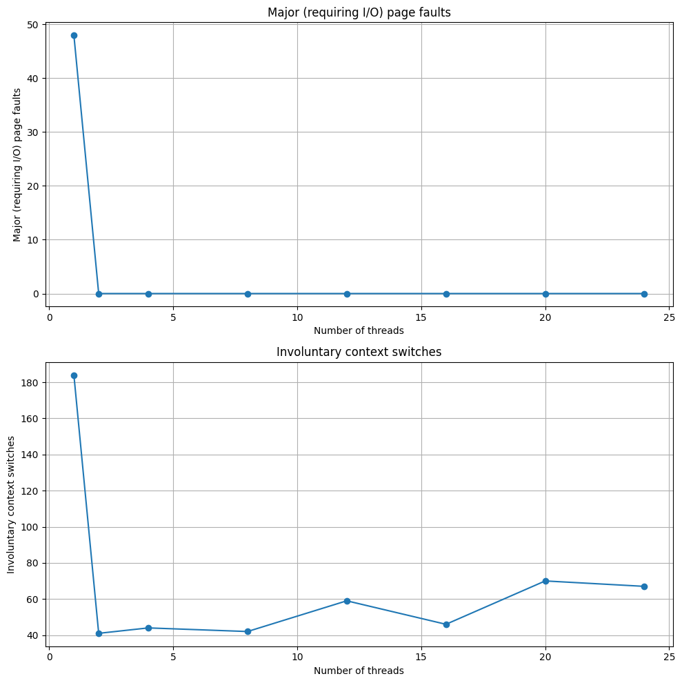

- **Major (requiring I/O) page faults**: The graph of ‘major page faults’ shows a high number of faults when using a single thread, with a drastic decrease already with the introduction of a few additional threads, then stabilising at zero for subsequent thread increments. A high major page fault at the beginning may indicate that the process is accessing a large amount of data for the first time, which is not resident in memory and must be loaded from slower storage devices (such as disk). The rapid decrease with multiple threads suggests that once data is loaded into memory, access becomes more efficient and less likely to cause further page faults. This may be a sign that memory is efficiently shared and utilised between threads after the first load.

- **Involuntary context switches**: Involuntary context switches show a high frequency at the beginning with only one thread, followed by a marked decrease and then a slight fluctuation but generally remaining at lower levels. A high number of initial involuntary context switches may be due to the fact that the operating system often has to intervene to manage the process, possibly due to resource waits. The decrease as threads increase indicates that the workload is more evenly distributed among threads, reducing the need for the operating system to intervene frequently. Fluctuations in later stages may reflect competition for system resources such as CPU or memory, particularly when the number of threads approaches the number of available physical cores.

The significant decrease in both page faults and involuntary context switches as threads increase is positive, indicating that the programme scales well in terms of resource management as parallelism increases. However, it is also essential to monitor these metrics to assess whether other types of overhead or limitations occur, such as memory bandwidth saturation or cache limitations, which may not be immediately apparent from execution times alone.

### Parallelisation Impact

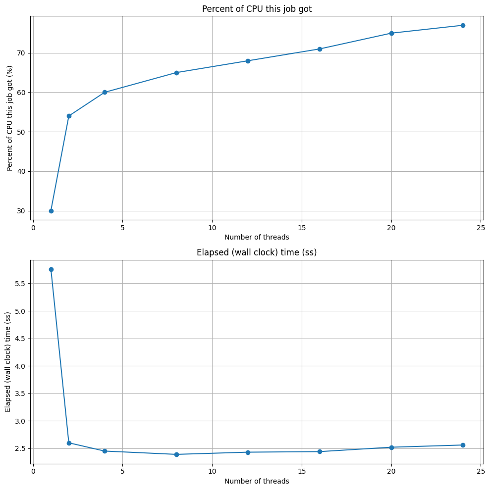

- **Percent of CPU this job got**: This graph shows a marked increase in the percentage of CPU used as the number of threads increases, starting from a relatively low level with only one thread and rising consistently to a plateau around 70 per cent. The increase in CPU percentage indicates that adding more threads allows the programme to utilise more processor resources simultaneously, suggesting good initial scalability of parallelism. The plateau may indicate that the programme is reaching the limits of scalability on this particular hardware architecture, possibly due to physical limitations such as the number of available cores, memory bandwidth saturation, or the workload is no longer able to be effectively divided between additional threads.

- **Elapsed (wall clock) Time**: The graph of execution time shows a sharp drop in execution time when going from 1 to several threads, then stabilising at a low value after about 4 threads. This is a typical indicator of a good response to initial parallelisation. The rapid reduction in execution time as the first threads increase shows that the programme benefits significantly from the distribution of the workload among multiple threads.

These results indicate that the programme has a good degree of parallelism up to a certain number of threads, beyond which no significant benefits are achieved. This type of information is crucial for deciding how to allocate resources in a production environment and for optimising further software development:

- Optimising the Number of Threads: Based on the results, it may be ideal to configure the programme to use a number of threads close to the plateau point to maximise efficiency.
- Exploration of Other Optimisations: Consider exploring optimisations beyond simply increasing the number of threads, such as improvements in the algorithm, memory management and synchronisation overhead reduction.

## MPI Analysis

The script was run with a single OpenMP thread per MPI task and increasing the number of MPI tasks. For this test was requested 2 nodes, using all the cores available on the THIN nodes.

```{bash}
## Load the required modules
module load openMPI/4.1.5/gnu/12.2.1

## Compile the program
mpicc -o mandelbrot_scal_mpi -fopenmp mandelbrot_mpi_omp.c

## Number of processes MPI to test for scalability
num_procs=(1 2 4 8 16 24 36 48)

## Run the program in loop for each number of processes
for procs in "${num_procs[@]}"
do
    echo "Running with ${procs} processes:"
    /usr/bin/time -v mpirun -np ${procs} ./mandelbrot_scal_mpi
done

echo "Scalability test is complete."
```

### Efficiency

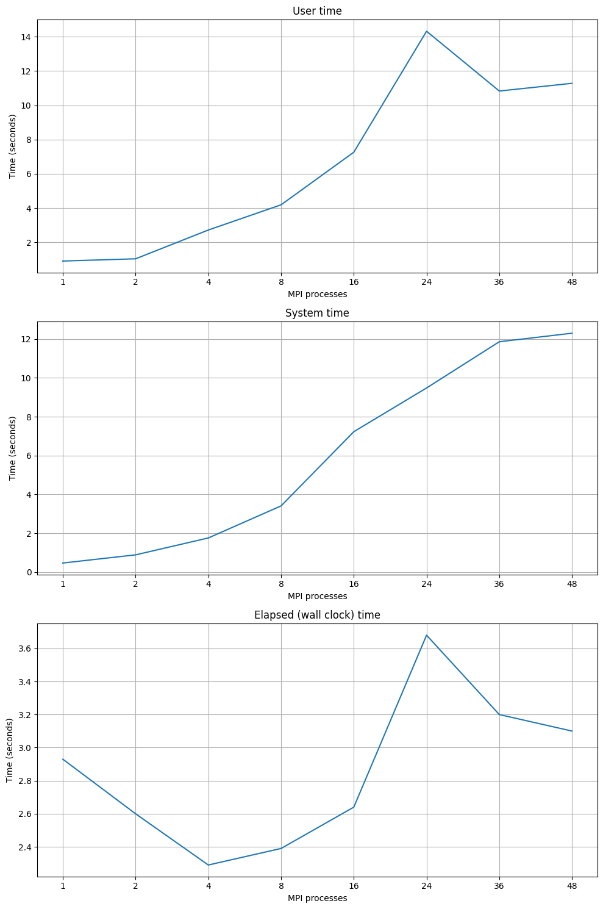

- **User time**: The curve shows an increase up to 16 processes, then a peak at 24 processes before decreasing and finally increasing again with 48 processes. The increase in user time to 16 processes may indicate that the addition of MPI processes does indeed contribute to the computational workload. However, the spike to 24 processes and subsequent decrease may suggest inefficiencies, possibly due to communication congestion or sub-optimal workload distribution.

- **System time**: The steady increase in system time with the increase in MPI processes suggests that there is an increasing system overhead, which may include handling communication between processes. The constant increase is an indicator that more processes result in higher communication or synchronisation costs at system level, which are not compensated for by a proportional increase in computing speed, leading to a decrease in overall efficiency.

- **Elapsed (wall clock) time**:  The graph initially shows a decreasing trend up to 4 processes, indicating good scalability. However, the time increases sharply at 16 processes, then increases dramatically at 24 before dropping to 48. The trend in execution time shows that there are peaks of inefficiency, especially at 24 processes. This could be due to increased waiting time for resources or inefficient handling of inter-process communication.

Overall, the scalability of the programme does not appear linear and shows signs of communication and system management overheads that affect overall efficiency as the number of processes increases. This could be due the nature of the problem, lack of load balancing between processes, congestion in the network or communications, or inefficient utilisation of system resources due to the configuration of the computing topology.

### Bottlenecks

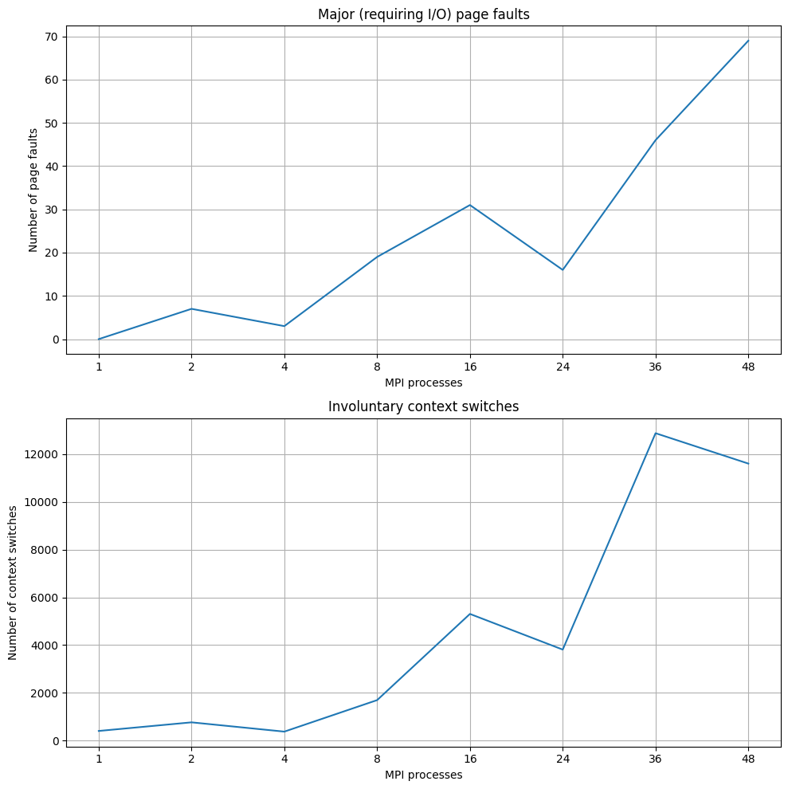

- **Major (requiring I/O) page faults**: Major page faults occur when the system has to read a page of memory from the disk because it is not present in RAM. This can happen if the process requires more memory than is physically available, forcing the system to swap pages between RAM and disk. The number of ‘Major page faults’ increases as the number of MPI processes increases, showing a significant peak at 16 processes, a decrease at 24, and then a further sharp increase to 48. This suggests that the system may be under memory pressure as the number of processes increases, forcing the operating system to resort to I/O operations that are significantly slower than memory operations. 

- **Involuntary context switches**: The number of ‘Involuntary context switches’ initially increases as the number of processes increases, shows a peak at 16 processes, then decreases to 24, and increases dramatically to 36 before decreasing again to 48. This indicates that there are potential inefficiencies in process management and CPU scheduling, especially with a large number of processes.

The increasing frequency of ‘major page faults’ suggests that it might be worth optimising memory usage within the programme. High ‘Involuntary context switches’ indicate that the workload may not be distributed efficiently among processes, or that the waiting time for resources (such as memory or I/O) is adversely affecting performance.

### Parallelisation Impact

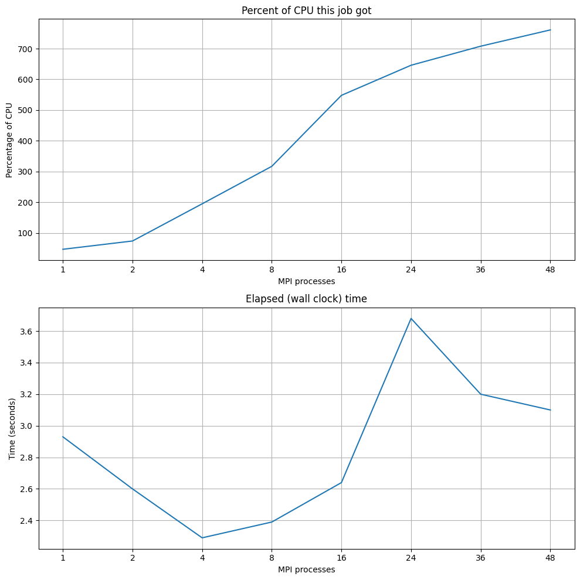

- **Percent of CPU this job got**: The percentage of CPU utilisation increases almost linearly with the increase in the number of MPI processes, indicating that the increase in processes leads to higher overall CPU utilisation. This is a positive sign suggesting good scalability in terms of the ability to handle parallel workloads. However, an increase above 100 per cent indicates that several cores are being used simultaneously, which is expected in a parallel environment such as MPI on a multicore system.

- **Elapsed (wall clock) Time**: This graph shows the total elapsed time from the beginning to the end of programme execution, which is essential for assessing the effectiveness of parallelisation in terms of reducing execution time. The trend shows a significant improvement in execution time as the number of processes increases from 1 to 8, indicating that parallelisation is having a positive impact. However, there is an unexpected peak at 24 processes, followed by a drop to 36 before a reduction to 48.

Analyses indicate that the programme benefits from parallelisation up to a certain number of processes, beyond which gains are reduced due to management overhead and communication complexity. These results suggest that there are key areas that can be optimised to further improve performance, such as memory management, workload balancing, minimising communication overheads and synchronisation.

## Hybrid Analysis

In this extra analysis, it was run the script with different combinations of MPI and OpenMP threads to analyse the scalability of the hybrid implementation. The script was run with a varying number of MPI tasks and OpenMP threads per task. For this test was requested 2 nodes, using half of the cores available on the THIN nodes.
    
```{bash}
## Compile the program
mpicc -o mandelbrot_hybrid -fopenmp mandelbrot_mpi_omp.c

## Executing the program with different number of MPI processes and OpenMP threads
for procs in 2 4 8 16 24
do
   for threads in 1 2 4 8 12
   do
      export OMP_NUM_THREADS=$threads
      echo "Running with $procs MPI processes and $threads OpenMP threads:"
      /usr/bin/time -v mpirun -np $procs ./mandelbrot_hybrid
   done
done
```

### Efficiency

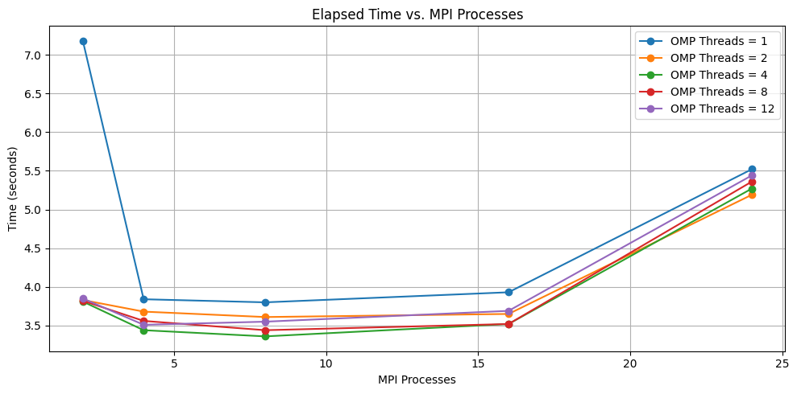
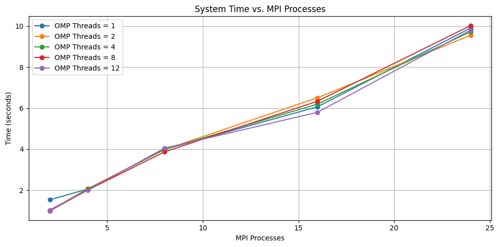
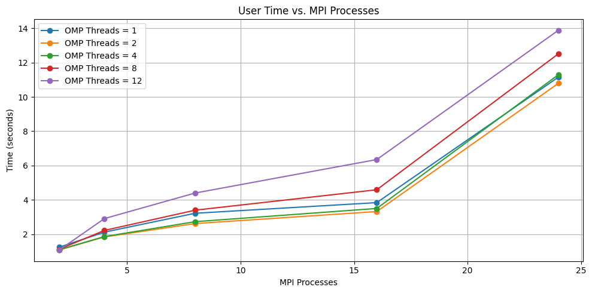

- **Scalability**: The decrease in elapsed time from 2 to 4 MPI processes shows initial scalability. However, beyond 4 MPI processes, the performance gains are less clear, and in some cases, the elapsed time increases. The system time increases linearly, indicating that the computational overhead scales proportionally with more MPI processes.

- **Threading Efficiency**: Higher OpenMP thread counts (8 and 12) show significantly higher user times, which might indicate inefficiencies or overhead in managing a large number of threads. For lower MPI process counts, using more OpenMP threads seems to improve elapsed time, but this benefit diminishes as the number of MPI processes increases.

- **Optimal Configuration**: For the given setup, using around 4 MPI processes with moderate OpenMP threads (4-8) seems to provide a good balance between user time, system time, and elapsed time. Using too many OpenMP threads (12) significantly increases user time, which suggests diminishing returns or potential bottlenecks in threading.

### Bottlenecks

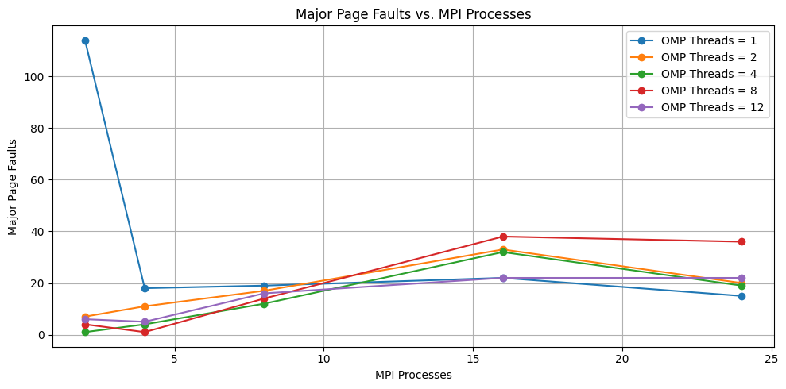
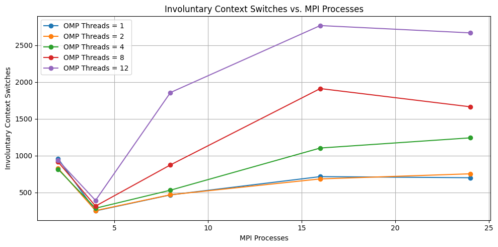

- **Context Switch Overhead**: The increase in involuntary context switches with higher OpenMP threads suggests significant overhead in managing threads, particularly for configurations with many MPI processes. This could be due to thread contention, synchronization issues, or inefficient scheduling.

- **Memory Access Issues**: The initial high number of major page faults for 1 OpenMP thread with 2 MPI processes may indicate memory access patterns that cause significant paging. However, this issue diminishes with more processes and threads. For higher OpenMP thread counts, the increased page faults suggest potential memory contention or inefficient use of shared memory resources.

- **Optimal Configuration**: To minimize context switches and page faults, a balanced configuration with moderate MPI processes and OpenMP threads (e.g., 4-8 threads) appears optimal. Avoid configurations with excessively high thread counts (e.g., 12 threads) as they introduce significant overhead and inefficiencies.

### Parallelisation Impact

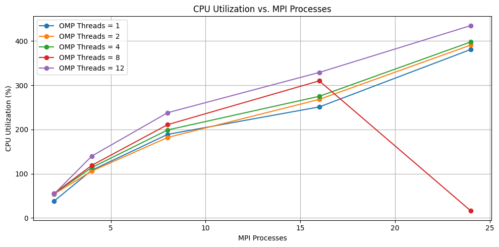


- **Scalability and Efficiency**: The initial decrease in elapsed time from 2 to 4 MPI processes shows good scalability and parallel efficiency. Beyond 4 MPI processes, the benefits of additional processes diminish, and the system might be hitting resource contention or communication overheads, especially evident at 24 MPI processes.

- **Threading Efficiency**: Higher OpenMP thread counts (8 and 12) improve CPU utilization, indicating better use of multicore resources. The anomaly observed with 8 OpenMP threads at 24 MPI processes suggests there might be specific issues with this configuration, potentially due to over-subscription or inefficiencies in thread management.

- **Optimal Configuration**: The best performance in terms of minimizing elapsed time and maximizing CPU utilization seems to be around 4-8 MPI processes with 4-8 OpenMP threads. Extremely high thread counts (12) can lead to higher CPU utilization but also increased overheads, affecting user time and system time negatively.

## Conclusion

This investigation into the scalability of the Mandelbrot set computation using a hybrid MPI and OpenMP setup reveals several key insights into efficiency, bottlenecks, and parallelization impact.

### Efficiency

The efficiency analysis shows that user time, system time, and elapsed time are crucial metrics. User time tends to increase with the number of MPI processes, with a significant rise when using higher OpenMP thread counts, particularly at 12 threads. System time increases linearly with MPI processes, indicating a proportional computational overhead. Elapsed time decreases significantly when moving from 2 to 4 MPI processes, demonstrating good initial scalability. However, beyond 4 MPI processes, the benefits diminish, and elapsed time either stabilises or slightly increases. The optimal configuration for efficiency is around 4-8 MPI processes with 4-8 OpenMP threads, avoiding configurations with 12 threads due to increased overhead.

### Bottlenecks

The bottleneck analysis focuses on major page faults and involuntary context switches. Involuntary context switches increase with the number of MPI processes, especially at higher OpenMP thread counts, indicating thread management overhead. Major page faults are initially high with 1 thread and 2 MPI processes but stabilize with higher process counts. Configurations with higher thread counts tend to have more page faults, suggesting memory contention or inefficiencies. Minimizing bottlenecks involves using moderate MPI processes (4-8) and OpenMP threads (4-8), avoiding the overhead introduced by high thread counts.

### Parallelization Impact

The parallelization impact is assessed through CPU utilization and elapsed time. CPU utilization increases with MPI processes and higher OpenMP thread counts, indicating effective use of multicore resources. An anomaly with 8 OpenMP threads at 24 MPI processes shows a significant drop in CPU utilization, suggesting resource contention or inefficiencies at higher concurrency levels. Elapsed time decreases significantly from 2 to 4 MPI processes, demonstrating good scalability, but stabilizes or increases slightly beyond this point. Lower thread counts (1-2) result in higher elapsed times compared to higher counts (4-12).

### Optimal Configuration and Recommendations

The best performance for the Mandelbrot set computation is achieved with 4-8 MPI processes and 4-8 OpenMP threads. Extremely high thread counts (12) lead to higher CPU utilization but also increased overheads, negatively impacting efficiency. Things that could be consiered to further optimize performance:

- Investigating and optimizing thread management to reduce user time and context switches at high thread counts.
- Optimize memory access patterns to reduce major page faults and improve overall efficiency.
- Conduct additional tests with configurations around 4-8 MPI processes and 4-8 OpenMP threads to refine the optimal setup.
- Use profiling tools to identify and optimize specific functions or operations causing inefficiencies.
